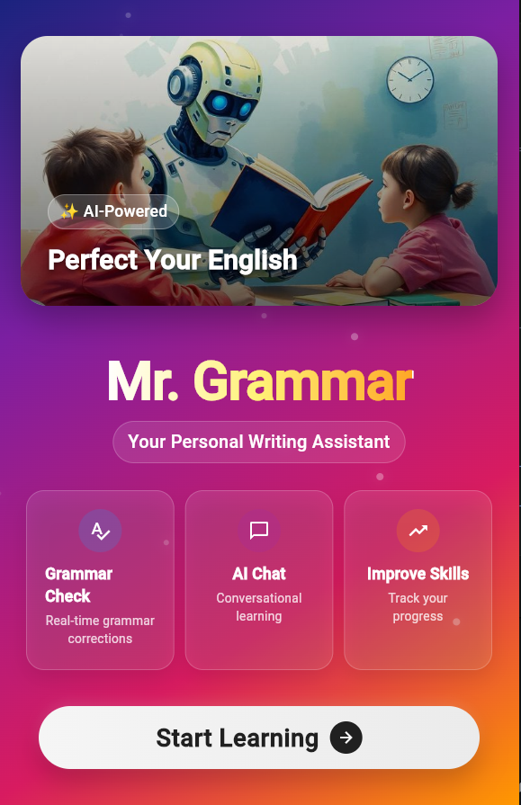

# 🤖 Mr. Grammar: An AI-Powered Conversational English Tutor

**A high-performance, real-time grammar correction and conversational learning assistant built with Flutter and a dual-engine AI architecture.**

[](https://flutter.dev)
[](https://opensource.org/licenses/MIT)
[]()

---

## 🎯 Project Goal

Mr. Grammar is an intelligent writing assistant designed to provide instantaneous grammatical feedback and engage users in conversational practice. The primary objective is to create a responsive, accessible, and effective tool for English language learners, focusing on performance and a seamless user experience.

## 🎬 Live Demo & Screenshots

A live demonstration of the project is available on the web.

**(Note: This is an ideal spot to embed a GIF of your application in action. A short screen recording showing the chat interface, a grammar correction, and the AI's response would be highly effective.)**

|  |  |
| :-----------------------------: | :---------------------------------------: |
|         *Homepage*         |             *Chat Interface*              |

---

## 🛠️ Engineering Philosophy & System Architecture

To deliver real-time feedback without compromising performance, Mr. Grammar employs a **Dual-Engine Hybrid Architecture**. This design strategically delegates tasks to the most appropriate AI model, balancing the precision of rule-based systems with the contextual power of large language models (LLMs).

### The Dual-Engine Approach

1.  **Engine 1: Rule-Based Grammar Analysis (`LanguageTool API`)**
    -   **Function:** Initial analysis of the user's input for grammatical, spelling, and stylistic errors.
    -   **Rationale:** Rule-based systems are exceptionally fast and computationally inexpensive. For the task of identifying discrete grammatical errors, they provide high accuracy and deterministic results. This lightweight approach ensures that users receive immediate feedback on common mistakes without the latency of a full LLM query.

2.  **Engine 2: Generative Conversational AI (`Google Gemini API`)**
    -   **Function:** Engages the user in a natural conversation when their input is grammatically correct.
    -   **Rationale:** When a user demonstrates correct grammar, the learning objective shifts from correction to contextual practice. The Gemini LLM excels at generating creative, relevant, and context-aware responses, simulating a real conversation with a tutor and encouraging continued user engagement.

### ➡️ Text Processing Workflow

The system follows a clear, logical flow to process user input:

`User Input (Flutter UI)` -> `[Engine 1: LanguageTool API Check]` -> `Logical Branch:`
- **If Errors Found:** -> `Generate Corrective Feedback (e.g., "I think you mean...")` -> `Display Correction in UI`
- **If No Errors:** -> `[Engine 2: Gemini API Query]` -> `Generate Conversational Response` -> `Display Response in UI`

This architecture ensures optimal resource utilization, providing a highly responsive user experience while leveraging the distinct strengths of both rule-based and generative AI.

---

## ✨ Core Features

| Feature                      | Description                                                                                                                            |
| ---------------------------- | -------------------------------------------------------------------------------------------------------------------------------------- |
| **Hybrid Grammar Correction**| Utilizes a dual-engine system for fast, accurate feedback on grammar, spelling, and style.                                             |
| **AI Conversational Tutor**  | Engages users in natural dialogue to improve fluency and confidence.                                                                   |
| **Text-to-Speech (TTS)**     | Provides audio playback of AI responses, aiding in pronunciation and listening comprehension.                                          |
| **Conversation History**     | Locally saves all conversations using `shared_preferences` for user review and progress tracking.                                        |
| **Multi-Language Support**   | Allows initiating conversations in several languages, with a primary focus on English correction.                                        |
| **Cross-Platform UI**        | A single, modern, and animated codebase built with Flutter supports Android, iOS, and Web.                                               |

---

## 📚 Future Work & Academic Research Directions

This project serves as a strong foundation for further research in applied NLP and computer-assisted language learning (CALL). Potential future work includes:

1.  **Developing a Hybrid On-Device Model:**
    -   **Concept:** Replace the `LanguageTool` API with a custom, lightweight on-device model (e.g., a distilled Transformer or a finite-state transducer) for offline functionality.
    -   **Research Value:** Explores the trade-offs between model size, inference speed, and accuracy in resource-constrained environments, a key topic in Efficient NLP.

2.  **Fine-Tuning for Domain-Specific Tutoring:**
    -   **Concept:** Fine-tune a smaller, open-source LLM (like Phi-3 or Llama 3 8B) on curated datasets of common errors made by learners from specific linguistic backgrounds (e.g., Arabic or Malay speakers).
    -   **Research Value:** Investigates the effectiveness of targeted feedback and personalized learning paths, contributing to the field of intelligent tutoring systems.

3.  **Longitudinal Analysis of User Improvement:**
    -   **Concept:** Implement a system to track the types and frequency of a user's grammatical errors over time. This data can be used to generate personalized progress reports and dynamically adjust the difficulty of the conversational prompts.
    -   **Research Value:** Provides a framework for empirically measuring the pedagogical effectiveness of an AI tutor and adapting its strategy based on user performance.

---

## 🚀 Technical Installation

### Prerequisites
- Flutter SDK (version 3.x.x or higher)
- An IDE such as VS Code or Android Studio

### Setup & Run

1.  **Clone the repository:**
    ```bash
    git clone https://github.com/Ad2m1109/Mr-Grammer.git
    cd Mr-Grammer
    ```

2.  **Create the environment configuration file:**
    In the root directory, create a file named `.env` and add your API key:
    ```
    GEMINI_API_KEY="YOUR_GEMINI_API_KEY"
    GEMINI_API_URL="https://generativelanguage.googleapis.com/v1beta/models/gemini-1.5-flash:generateContent"
    ```

3.  **Install dependencies:**
    ```bash
    flutter pub get
    ```

4.  **Run the application:**
    ```bash
    flutter run
    ```

### Build the Project

You can build the application for various platforms using standard Flutter commands:
```bash
# Build an Android APK
flutter build apk --release

# Build an iOS App Bundle
flutter build ios --release
```

## irtiva-contact
For any inquiries, please contact:
*   **Email**: ademyoussfi57@gmail.com
*   **LinkedIn**: [Adem Youssfi](https://www.linkedin.com/in/adem-youssfi-2289672a4)
*   **Personal Website**: [Adem Youssfi's Website](https://ademyoussfi.onrender.com)